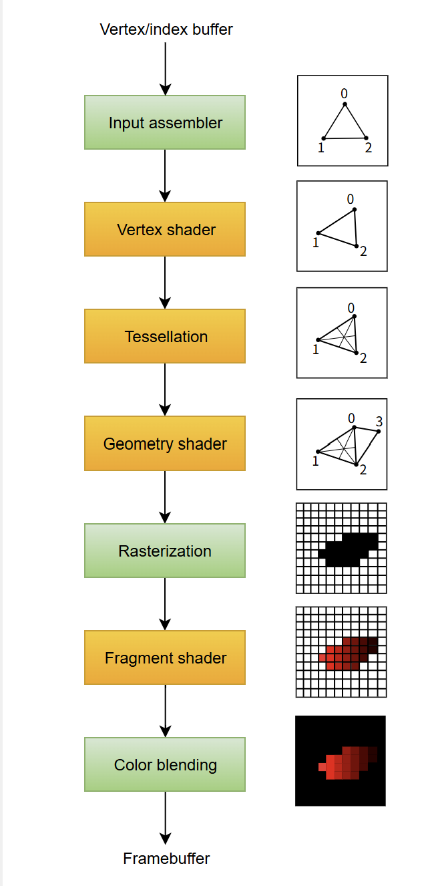

# 개요

vulkan의 파이프라인은 dx의 그것과 거의 다르지 않음.

<figure><figcaption></figcaption></figure>

기존 DX11, OpenGL은 고정 파이프라인 객체, 상수버퍼, 셰이더등파이프라인객체들 대한 setting을 OmSetBlendState, OmSetDepthstensilState, pssetShader 같은 함수들으로 파이프라인 도중에 교체할 수 있었음. 그러나 vulkan은 한번 세팅된 파이프라인은 교체 불가능. 따라서 다양한 파이프라인을 미리 컴파일해서 준비해 놔야 한다.

이방식의 장점은 전체 조합이 미리 확정된 상태이므로 cpu 드라이버 쓰레드에서 최적화가  가능하다.\
기존 방식과 비교하면

* dx11
  * Blend + Rasterizer + Shader 조합이 유효한지 검사
  * 상태 변경이 무엇인지 분석
  * RenderTarget format과 Shader output이 맞는지 검사
  * InputLayout과 VertexShader input 매칭 검사
  * 파이프라인이 바뀌었는지 확인
* DX11에서 상태가 바뀌면:
  1. \*\*드라이버(CPU)\*\*가 모든 상태를 다시 모은다
  2. 유효성 검사(state validation)를 한다
  3. GPU가 이해할 내부 명령 구조로 “변환”한다
  4. GPU용 파이프라인 구성을 다시 빌드한다(캐시 존재하지만 미스 자주 남)
  5. 최종 GPU 명령을 생성한다

이런 작업들을 cpu에서 gpu 명령을 생성하기 위해 매 draw 전에 실행 한다. 이것 자체의 비용이 크다. 전체파이프라인을 다시구성하기때문이다. 그에 반해 vulkan이나 dx12같은 현대적인 api들은

* **파이프라인 객체(PSO)가 미리 완성된 형태로 만들어진다.**
* 상태 조합은 “드라이버가 미리 해둔 것” 또는 “앱이 빌드시 미리 해둔 것”
* draw()에서는 PSO를 바꾸기만 하면 된다 → 조합 계산 없음

즉:

* DX11: draw마다 CPU가 “상태 조합 계산 + 번역”
* Vulkan/DX12: 미리 계산된 PSO를 GPU에 그대로 바인딩하기만 함

핸들만 교체하는 식으로 검증과 재조립 비용의 오버헤드가 줄어들기 때문에 가능하다.

**PSO 캐시**는 이 최적화된 파이프라인 생성 비용 자체를 미리 사전에  파일형태로  저장해놔서 생성 비용자체를 런타임에 0에 가깝게 만드는것.

* **통째로 미리 컴파일”** = 파이프라인 객체 자체가 immutable이고 draw 시점에 빠르다는 뜻
* **“PSO 캐시”** = 그 파이프라인을 _생성하는 비&#xC6A9;_&#xC744; 빠르게 하려는 기능
* pso 캐시는 os나 gpu 드라이버, os 환경에 종속적이기에 사용자가 직접 만들어야한다. 개발사에서 미리 컴파일해서 배포 불가능

